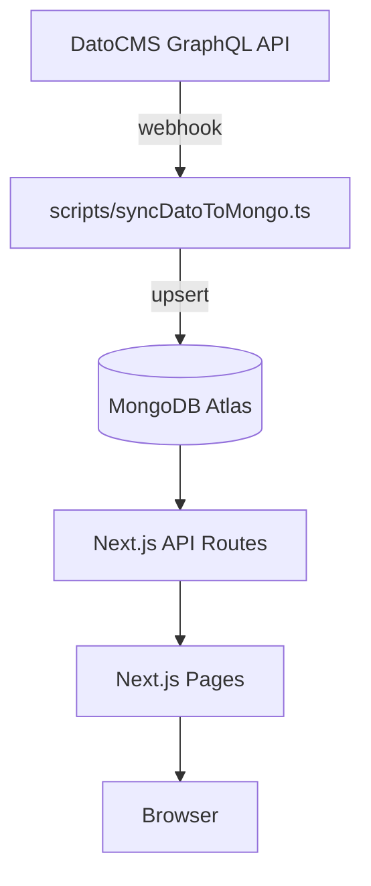

# WJC Website — Next.js + MongoDB + DatoCMS

This monorepo contains the production-ready source code for the WJC public website, including:

* **Next.js 15 App Router** frontend styled with TailwindCSS.
* **REST & GraphQL** APIs served from Next.js route handlers.
* **MongoDB Atlas** data-layer (via Mongoose ODM).
* **DatoCMS** headless CMS used by editors — kept in-sync with Mongo through `scripts/syncDatoToMongo.ts`.
* Email delivery (SendGrid/Resend), JWT auth, rate-limiting, ESLint/Prettier, Jest ≥ 80 % coverage, Docker, and a GitHub Actions deployment pipeline to Vercel.

## 1. Local development

```bash
# clone & install
pnpm install

# copy environment template and fill values
cp .env.example .env.local

# start Mongo & web using Docker Compose (recommended)
docker-compose up -d

# or run the dev server directly
pnpm dev
```

Open http://localhost:3000 ↗ to see the site.

## 2. Environment variables

Variable | Purpose
--- | ---
`MONGODB_URI` | MongoDB connection string (e.g. `mongodb+srv://…`)
`DATOCMS_READONLY_TOKEN` | Read-only API token from DatoCMS
`JWT_SECRET` | Secret for signing admin JWTs
`SENDGRID_API_KEY` / `RESEND_API_KEY` | Email provider credentials (choose one)
`RATE_LIMIT_POINTS` | Requests allowed per window (default 10)
`RATE_LIMIT_DURATION` | Time window in seconds (default 60)

Create `.env.local` (not committed) by copying `.env.example`.

## 3. Syncing content from DatoCMS → MongoDB

The one-way synchronisation script pulls content from the DatoCMS GraphQL Content API and upserts it into the corresponding MongoDB collections.

```bash
pnpm ts-node scripts/syncDatoToMongo.ts
```

Add a webhook inside DatoCMS → **Settings → Webhooks** that triggers this script on content publish (`POST` to `/api/revalidate` or your preferred serverless endpoint).

## 4. Testing

```bash
pnpm test            # jest --coverage
```

Coverage thresholds are enforced in CI (≥ 80 %).

## 5. Linting & formatting

```bash
pnpm lint            # eslint
pnpm format          # prettier
```

## 6. Docker

```bash
docker-compose up --build
```

The stack starts two services:

* `mongo` → MongoDB 6
* `web`   → Next.js listening on port **3000**

## 7. Deployment

Every push to `main` triggers the GitHub Actions workflow at `.github/workflows/ci.yml` which:

1. Installs dependencies.
2. Runs ESLint and Jest.
3. Builds the Next.js app.
4. Deploys to **Vercel** using the project/team tokens stored in repo secrets.

## 8. Architecture



---

Made with ❤️ and ☕ by the WJC Tech Team.
